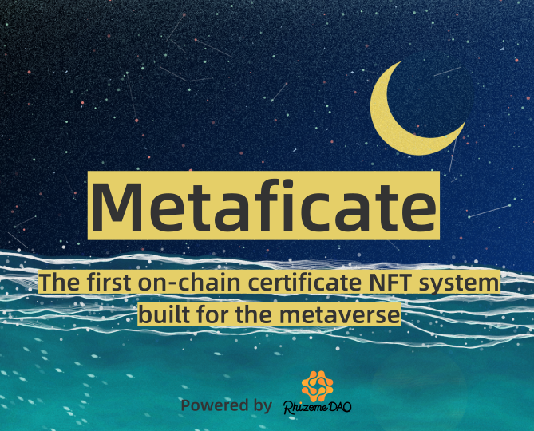
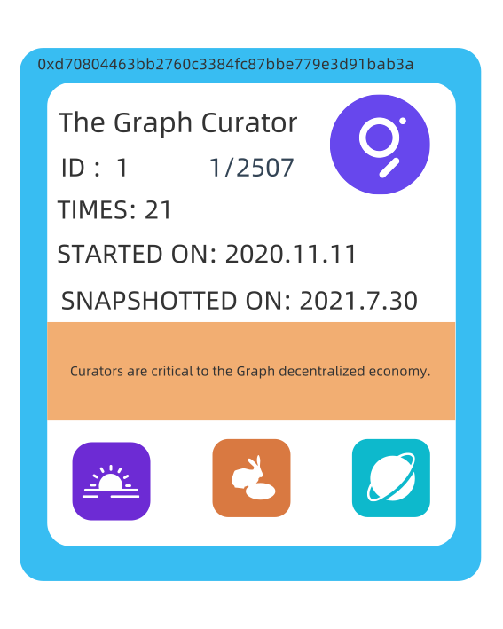

	
	 
	 

	<b>The first on-chain certificate NFT system built for the metaverse.</b>

	💫 <a href="https://www.metaficate.com/">metaficate.com</a>
	🌱 <a href="https://twitter.com/rhizomedao">@RhizomeDAO</a>

	<a href="https://github.com/Metaficate/metaficate.github.io/blob/master/readme/readme-cn.md">Readme - Chinese Version 中文版</a>
	 
  ## About
In reality, some centralized institutions issue certificates to people for their special achievements. For example, the university diplomas in China, which are verified by universities and the Ministry of Education and have official websites that provide verification services.

These certificates symbolize a person's accomplishments over time, making it easy for others to learn about this information.

In the web 3 world consists of the entire Ethereum ecosystem and other public chains, we combine some cool innovations and let them react with each other, generating self-certifying NFTs as a decentralized visual credential with the entire process and NFT metadata all on the chain as much as possible.

  ## Why Layer 2

Store data permanently on Ethereum mainnet is extremely expensive. For a more affordable on-chain storage of NFT's metadata, we chose Ethereum's layer 2. 

Currently, we added support for Polygon. In the future, we will add support for other Layer 2 scaling solutions including Optimistic, Arbitrum, etc. We also consider supporting other public chains.
  
  ## EXAMPLE 1: The Graph Curator Metafication
 
Metaficate was built for the [Layer2 Hackathon](http://hackathon.iosg.vc/?ref=metaficate) launched by [IOSG VENTURES](https://iosg.vc/?ref=metaficate) and [CHAINLINK](https://chain.link/?ref=metaficate). This is an attempt to start from scratch, the product still needs to be perfected.

The Graph Curator Metaficate is a sufficiently complex Metaficate use case. 
	
Curators use their knowledge of the web3 ecosystem to assess and signal on the subgraphs that should be indexed by The Graph Network. If an address has had at least one relevant onchain interaction before the snapshot time, then its owner can click the claim button on the demo page to get a metaficate NFT.

Recently, the POAP badge NFTs, distributed by The Graph, has been subjected to many random number generator attacks. This resulted in some eligible developers not receiving their POAPs, and both the NFT and the corresponding GRT rewards were stolen by the attackers.

 Unlike NFTs such as POAP and Galaxy.eco, Metaficate NFTs are created, generated and claimmed on the blockchain. This decentralized native NFT prevents NFTs belonging to a particular address from becoming fraudulent and ensures ensuring that its data can almost never be lost or tampered with.

	
	 
	 

## More use cases

1. On-chain certifacate without centralized endorsement: Metaficate's whitelist data sources, generation codes and NFT card information are all stored on the blockchain, which will strengthen the security of the contract in the future and establish a common standard to serve more web3 users.
2. More efficient community management: Community managers can use some existing tools, for example, the collab.land robot that already supports Polygon NFT, to establish accurate user classification for community discord and telegram groups and improve the efficiency of community management.
3. DAO governance: Metaficate will create a whitelist tool for DAO contracts, allowing DAO members to claim membership card-style Metaficate NFTs as their DID that will be able to be used directly in the web3 governance platform being developed by RhizomeDAO and our partners.
4. Visual records in the metaverse: in the metaverse you will be able to show your past on the chain like an artwork, i.e. a Metaficate NFT storing different on-chain actions. in the future, as some generative artists join the Metaficate ecosystem as curators, users will be able to get Metaficate NFTs with a higher artistic quality.

